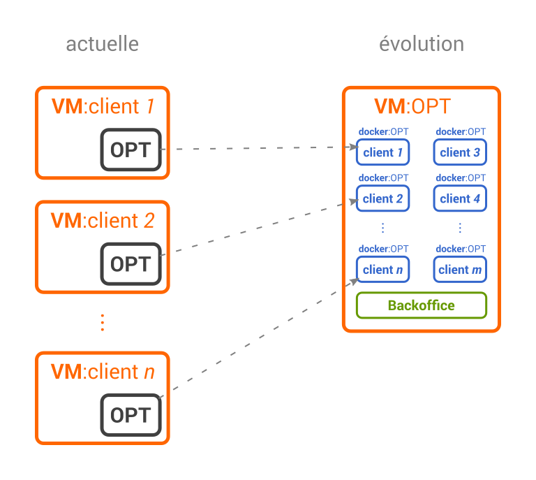

# OPT

**OPT** stands for _**Open Printing Tunnel**_ is  a solution to compress printing stream from `TSE` instance to a remote printers.

## Components

* [backend](./backend) **(wip)**: manage _customers_ and _companies_ permissions through a _REST_ API in `Python`/[`Django`](https://djangoproject.com) ;
* [daemon](./daemon) **(done)**: core daemon to manage compression channels ;
* [frontend](./frontend) **(wip)**, interface to manage in [`Vue.js`](http://vuejs.org/)  :  
    * let administrators or sysadmin manage printers and location (_add_, _remove_, _edit_, etc.) ;
    * let users check printer status ;
* [proxy-web](./daemon/proxy-web) **(done)**: proxy request from customer's frontend to backend ;
* [deploy](./deploy) **(wip)**: deployment tool.
* [webapp](./webapp) **(deprecated)**: legacy application.

## Requirements

Most of the requirements are managed by the Docker containers themselves. What you need is a worki Docker environment (_i.e._ `docker` and `docker-compose`).

For the host system we recommend **Debian-based** OS, other distribution are not officially supported. For reference, here is a list of the main requirements:

* Debian `6.0+` or Ubuntu-server `16.04+` ;
* `docker` `≥1.10` ;
* `docker-compose` `≥1.7.0`;

## Development

We are using a `docker-compose` to manage the various containers. See [how to docker](docs/HOW-TO-DOCKER.md) for install and basics: 

    cd open-printing-tunnel-master/  # project root directory
    docker-compose build  # create the containers images 
    docker-compose up  # start project

### Python and virtualenv

### Requirement

* Python `3.5` ;
* (`Pip` should be [available](https://pip.pypa.io/en/stable/installing/#do-i-need-to-install-pip)).

### Installation

* [Create a Python virtual environement](https://docs.python.org/3.5/library/venv.html#creating-virtual-environments) ;

        python3.5 -m venv env
    
* [activate the virtual env](https://packaging.python.org/en/latest/installing/#creating-virtual-environments)

        source env/bin/activate
        
* install project's requirements:
    
        python3.5 -m pip install -r requirements-dev.txt   
    
## Glossary

* **infrastructure**: a machine that manage the customer's tunnels. Can manage multiple customers ;
* **customer**: company that require our service. Can have one or more _hosts_ ;
* **host**: a machine accessible through Internet by its IP address or FQDN. Can have one or more _tunnels_ ;
* **tunnel**: an SSH's tunnel between our infrastructure and the host's machine. Can have one or more channels (each for a different printer);
* **channel**: a port forwarding configuration from _infrastructure_ to _host_ through a _tunnel_.

## Architecture design

## Documentation

* [Troubleshooting](docs/TROUBLESHOOTING.md) ;
* [how to docker](docs/HOW-TO-DOCKER.md) ;
* [daemon usage](./daemon/) ;

## Develop

* [Setup Django Backend](backend/README.md)