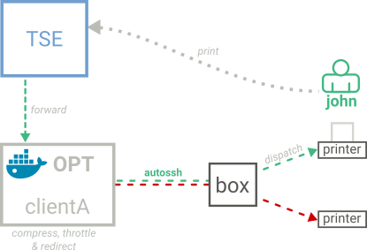

# OPT

**OPT** stands for _Open Printing Tunnel_ is  a solution to compress printing stream from `TSE` instance to a remote printers.

    

More screenshots in [./docs/screenshots/](./docs/screenshots/).

## Components

* [backend/](./backend): manage OPT containers, usually one per customer (e.g. `opt.coaxis.com`) ;
    * _admin_: backend to managed customers and users also provide a _REST_ API ;
    * [frontend/](./backend/frontend): web interface to manage daemon containers ;
* [daemon/](./daemon): manage compression channels through the UNIX daemon `mast` and `mast-utils` ;
    * [api/](./daemon/api): REST API to control `mast` daemon  and `mast-utils` ;
    * [frontend/](./daemon/frontend): web interface to manage sites and printers (_add_, _remove_, _edit_, etc.) and check printers status ;
    * [optbox/](./daemon/optbox): development container to simulate remote device ;
    * [proxy-web/](./daemon/proxy-web): proxy requests to frontend or the API.
* [deploy/](./deploy): scripts for project's deployment ;
* [nginx/](./nginx): main server configuration to reach backend ;

    
## Architecture

### Printing with OPT

## Admin

Administrators use the Django admin to:
* create and manage _clients_ ;
* manage _employees_ and their permissions to control _daemons_ ; 

### Back-office: Containers Management

Technician employees use the back-office to:

* create and manage _daemons_' container ;

#### Permissions

| User               | Clients        | Daemons                  | Networks            | Admin                     | Description                  |
| -----------------: | :------------: | :----------------------: | :-----------------: | :-----------------------: | -----------------            |
| `anonymous`        | -              | -                        | -                   | -                         |                              |
| `employee`         | -              | -                        | -                   | -                         |                              |
| `technician`       | ✔              | ✔                        | -                   | -                         | flag to enable on `employee` |
| `admin`            | ✔              | ✔                        | ✔                   | ✔                         |                              |

### Front-office: OPT Container

Employees use front-office to:

* create and manage _sites_ ;
* create and manage _printers_' tunnel ;

### Infrastructure evolution

## Documentation

* [Troubleshooting](./docs/troubleshooting.md) ;
* [How to Docker](./docs/how-to-docker.md) ;
* [Daemon usage](./daemon/) ;
* [Setup Django Backend](backend/README.md)

### Requirements

Most of the requirements are managed by the `Docker` containers themselves. What you need is a working `Docker` environment (_i.e._ `docker` and `docker-compose`).

For the host system we recommend **Debian-based** OS, other distribution are not officially supported. For reference, here is a list of the main requirements:

* Debian `6.0+` or Ubuntu-server `16.04+` ;
* `docker` `≥1.12` ;
* `docker-compose` `≥1.7.0`;
* `Python` `≥3.5`.

### Installation

From developer computer, run:

    $ cd frontend/
    $ npm run build
    $ cd ../deploy/
    $ archive="$(./create_archive.sh | tail -n 1)"
    $ ./send_archive.sh "$archive"
    
If you need to setup a python environment, please have a look at our short [Python and virtualenv doc](./docs/how-to-python-and-virtualenv.md).
### Development

We are using a `docker-compose` to manage the various containers. See [how to docker](./docs/HOW-TO-DOCKER.md) for install and basics: 

    cd open-printing-tunnel-master/  # project root directory
    docker-compose build  # create the containers images 
    docker-compose up  # start project

### Glossary

* **channels**: a port forwarding configuration from _datacenter_ to _printer_ (one per printer) ;
* **clients**: company that require printing stream compression, may have several sites, each with one or many printers ;
* **datacenter**: manages TSE instances for differents sites and clients, also manage the `OPT` instance ; 
* **remote devices** or **sites**: a machine at the customer location accessible through Internet by its IP address or FQDN. Each device can be connected to one or more printers locally to forward data streams ;
* **tunnels**: an SSH's tunnel between the data-center and the remote machine. Can have one or more channels ;
* **configuration** : are stored in each container in `/etc/mast/$site_id` while the `/etc/mast/` directory is a docker volume.

### What's under the hood?

* Backend: [`Django`](https://djangoproject.com), [`Flask`](http://flask.pocoo.org/) ;
* Containers: [`Docker`](https://docs.docker.com/engine/), [`docker-compose`](https://docs.docker.com/compose/), [`docker-py`](http://docker-py.readthedocs.io/) ;
* Daemon: `bash`, `make`, [`trickle`](https://github.com/mariusae/trickle), `ssh`, [`autossh`](http://www.harding.motd.ca/autossh/) ;
* Deployment: `bash` ;
* Frontend: [`Vue.js`](http://vuejs.org/), [`Bootstrap`](http://v4-alpha.getbootstrap.com/), [`webpack`](https://webpack.github.io/docs/tutorials/getting-started/), [`Express`](http://expressjs.com/) ;
* RESTful API: 
    [`Django REST framework`](http://www.django-rest-framework.org/),
    [`Flask-RESTful`](http://flask-restful.readthedocs.io/) ;
* Server: [`nginx`](http://nginx.org/).
