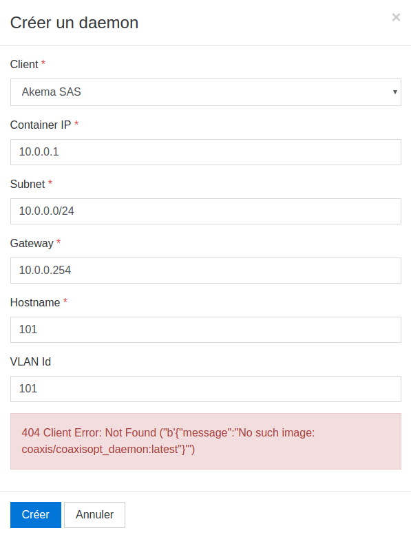

### Back-office

We are using a `docker-compose` to manage the various containers. See [how to docker](./docs/HOW-TO-DOCKER.md) for install and basics: 

    cd open-printing-tunnel-master/  # project root directory
    docker-compose build  # create the containers images 
    docker-compose up  # start project

Then you need to add a super user to the backend if none exists:

    docker exec -it coaxisopt_backend bash
    ./manage.py createsuperuser

Create the `coaxisopt_daemon` container so we can use it as template:

        cd daemon
        docker build -t coaxisopt_daemon .

After having create a `client` we will need to create a `daemon`

> 

Finally **go to [http://localhost/](http://localhost/)**

### Front-office

    cd daemon/
    ./help-me.mk build dev 

You can run the whole `docker-compose` as above then identify the `daemon` container's IP address:

    docker inspect coaxisopt_daemon_1   --format "{{ json .NetworkSettings.Networks }}" | python -m json.tool
    
For instance we will go to [http://172.18.0.3](172.18.0.3) with this output:

    {
        "coaxisopt_default": {
            "Gateway": "172.18.0.1",
            …
            "IPAddress": "172.18.0.3",
            "MacAddress": "02:42:ac:12:00:03",
        }
    }
